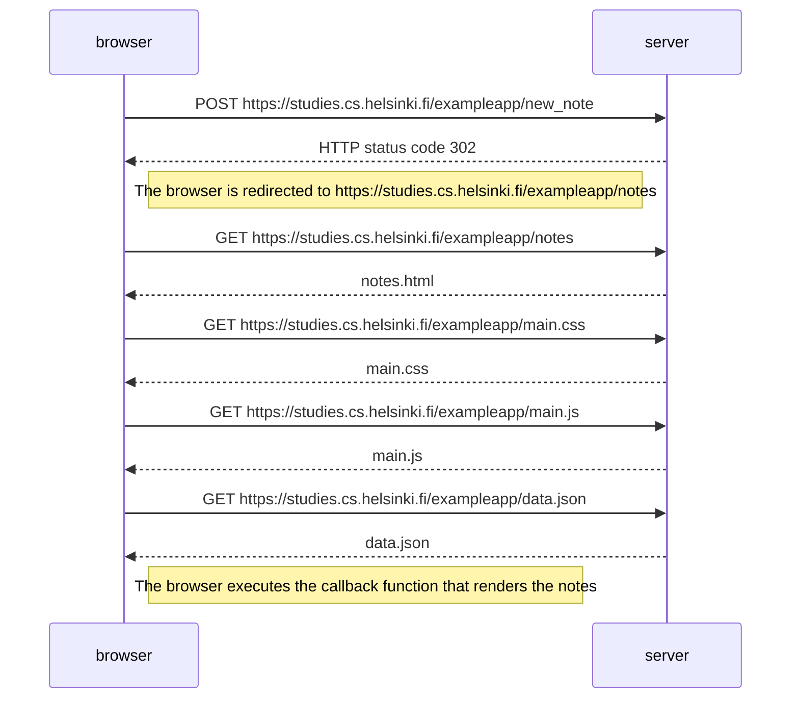

```mermaid
sequenceDiagram %% diagram
participant browser
participant server

browser->>server: POST https://studies.cs.helsinki.fi/exampleapp/new_note
server-->>browser: HTTP status code 302
Note right of browser: The browser is redirected to https://studies.cs.helsinki.fi/exampleapp/notes
browser->>server: GET https://studies.cs.helsinki.fi/exampleapp/notes
server-->>browser: notes.html
browser->>server: GET https://studies.cs.helsinki.fi/exampleapp/main.css
server-->>browser: main.css
browser->>server: GET https://studies.cs.helsinki.fi/exampleapp/main.js
server-->>browser: main.js
browser->>server: GET https://studies.cs.helsinki.fi/exampleapp/data.json
server-->>browser: data.json
Note right of browser: The browser executes the callback function that renders the notes
```